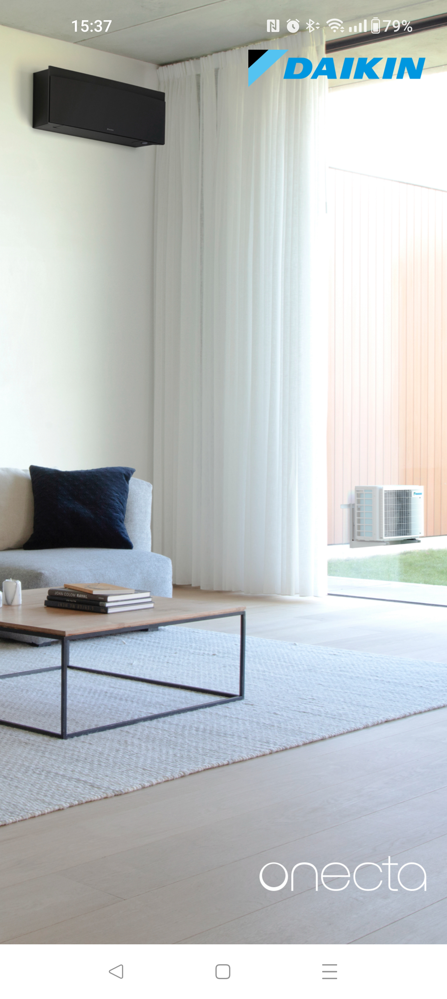
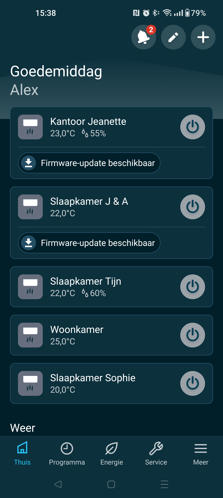
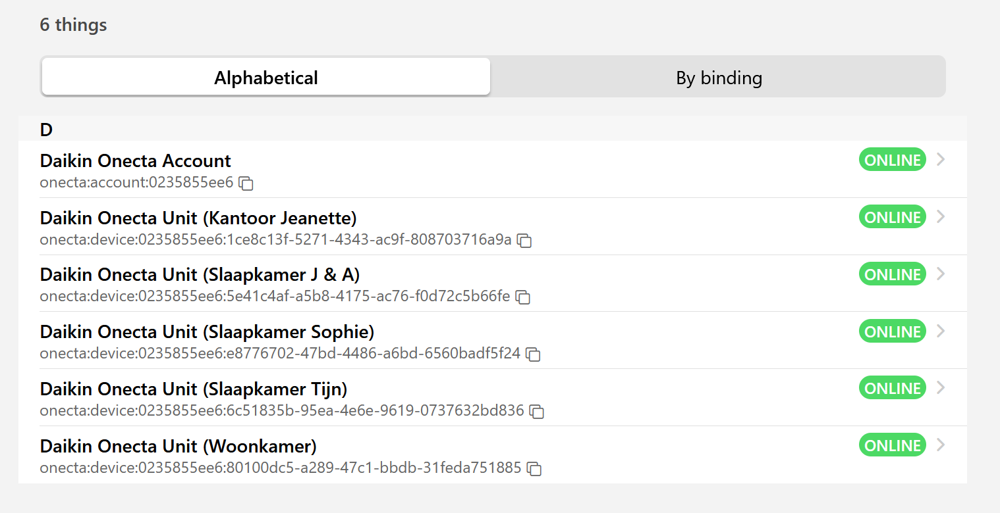
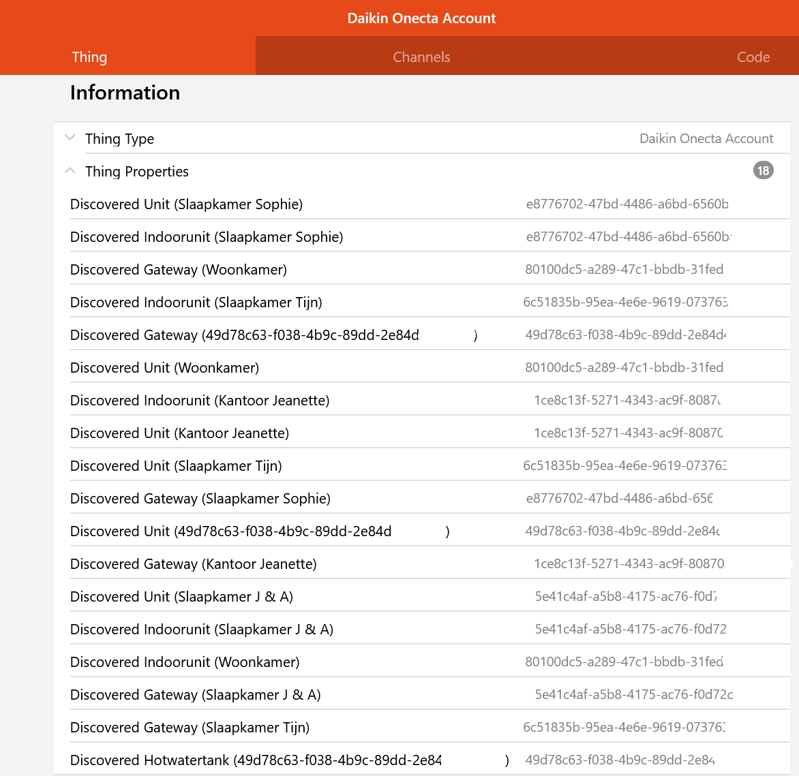

# Onecta Binding 

With the newer Daikin units it is no longer possible to control them directly. The units can only be connected to the Daikin cloud called Onecta.
The units can then 'only' be controlled with the Onecta app on a phone or tablet.
This binding makes it possible to still control the units with OpenHAB. It's now done by connecting the binding to Daikin's Onecta.
The unit information is then received from the Daikin cloud just like the app. Commands to the units also run via the Daikin Cloud.
Older units can also be controlled with this binding as long as they are registered in Onecta.


<br>



## Supported Things

Basically all devices connected to Daikin Onecta cloud could be connected with the binding.

- `bridge`: Ensures the connection to Onecta cloud and the recognition of connected units

## Discovery

The bridge can be added using the UI or can be configured with a thing-file. 
Once the bridge is set up and connected to the Daikin cloud it will receive all information about the connected units. 
Based on this information it will recognize the different units. 
All recognized units end up in the Inbox, are listed in the logging and in the UI they are shown in the thing properties.<br>
Things that can be discovered are:
- Daikin Onecta device (...)<br>Is the thing to control the unit.
- Daikin Onecta (Gateway)<br>Is the thing for info about the network controler.
- Daikin Onecta (IndoorUnit)<br>Is the thing for info about the indoor unit.
- Daikin Onecta (DomesticHotWaterTank)<br> Is the thing to control the Hot water tank. 



## Bridge Thing Configuration


| Name             | Type    | Description                                                    | Default | Required | Advanced |
|------------------|---------|----------------------------------------------------------------|---------|----------|----------|
| `UserId`           | text    | UserId / Emailadress Onecta account                            | N/A     | yes      | no       |
| `Password`         | text    | Password to access Onecta account                              | N/A     | yes      | no       |
| `refreshInterval`  | integer | Interval the device is polled in sec.                          | 60      | yes      | no       |
| `refreshToken`  | text    | Is filled automaticly with Refresh token to speedup connection | N/A      | No       | no       |
| `rawdataLogging`    | boolean | If true raw JSon Data is dropt in log file                     | false   | yes      | no       |
| `stubdataFile`  | text    | Path to JSon stubdata file only for debugging                  | N/A     | no       | no       |


## Discovered Things Configuration

| Name            | Type    | Description                                                                                             | Default | Required | Advanced |
|-----------------|---------|---------------------------------------------------------------------------------------------------------|---------|----------|----------|
| `unitID`        | text    | UID Unique Identifier. <br>If this thing is created in a thing-file this UIT can be found in the logging | N/A     | yes      | no       |
| `refreshDelay`  | integer | Refresh Delay in sec. <br>Only available for thing 'device' and 'DomesticHotWaterTank'                    | 15      | yes      | no       |
Explanation Refresh Delay: <br>
If a command is sent from the binding to OnectaCloud, it needs time to be processed by Daikin. 
This can cause items to flip-flop. <br>For example: You switch a Unit 'On' with the binding. 
Daikin will process this command and control the unit, this processing can take 15 seconds. 
During this time, the binding may have requested a data refresh from OnectaCloud. 
If this 'On' command has not yet been processed by Daikin, this will result in the OH item returning to 'Off'. 
After a while, when Daikin has processed it and another data refresh is performed by the binding, 
the OH item will return to 'On'. <br> The Refresh Delay prevents an item from being refreshed (for x seconds) after a command has been issued from this item.
Other items will be updated during this time with a data refresh

## Channels

### Unit
| Channel | Type   | Read/Write | Description                 |
|---------|--------|------------|-----------------------------|
| control | Switch | RW         | This is the control channel |

## Full Example

_Provide a full usage example based on textual configuration files._
_*.things, *.items examples are mandatory as textual configuration is well used by many users._
_*.sitemap examples are optional._

### Thing Configuration

```java
Bridge onecta:account:bridge "Onecta Bridge" [userId="aaaaa@bbbbbbb.xx",password="***************", refreshInterval=5, rawdataLogging=false] {
        Thing device livingRoom "Onecta living room Unit" [unitID="80100dc5-a289-47c1-bbdb-31feda0000000", refreshDelay=15]
        Thing gateway livingRoom "Onecta living room Gateway" [unitID="80100dc5-a289-47c1-bbdb-31feda0000000", refreshDelay=15]
        Thing domesticHotWaterTank livingRoom "Onecta living room Watertank" [unitID="80100dc5-a289-47c1-bbdb-31feda0000000", refreshDelay=15]
        Thing indoorUnit livingRoom "Onecta Woonkamer living room" [unitID="80100dc5-a289-47c1-bbdb-31feda0000000", refreshDelay=15]
        }
```
### Item Configuration

```java
Example item configuration goes here.
```

### Sitemap Configuration

```perl
Optional Sitemap configuration goes here.
Remove this section, if not needed.
```

## Any custom content here!

_Feel free to add additional sections for whatever you think should also be mentioned about your binding!_
