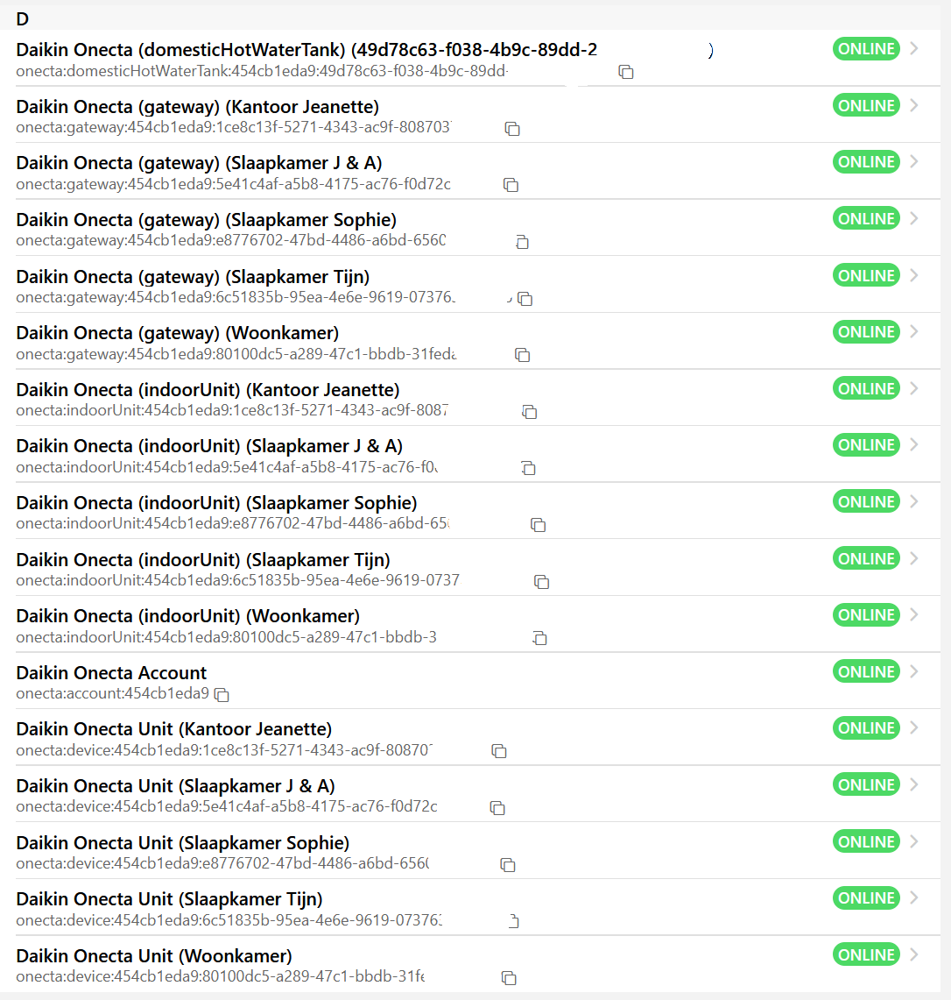

# Onecta Binding 

With the newer Daikin units it is no longer possible to control them directly. The units can only be connected to the Daikin cloud called Onecta.
The units can then 'only' be controlled with the Onecta app on a phone or tablet.
This binding makes it possible to still control the units with OpenHAB. It's now done by connecting the binding to Daikin's Onecta.
The unit information is then received from the Daikin cloud just like the app. Commands to the units also run via the Daikin Cloud.
Older units can also be controlled with this binding as long as they are registered in Onecta.


<br>



## Supported Things

Basically all devices connected to Daikin Onecta cloud could be connected with the binding.

- `bridge`: Ensures the connection to Onecta cloud and the recognition of connected units

## Discovery

The bridge can be added using the UI or can be configured with a thing-file. 
Once the bridge is set up and connected to the Daikin cloud it will receive all information about the connected units. 
Based on this information it will recognize the different units. 
All recognized units end up in the Inbox, are listed in the logging and in the UI they are shown in the thing properties.<br>
Things that can be discovered are:
- Daikin Onecta device (...)<br>Is the thing to control the unit.
- Daikin Onecta (Gateway)<br>Is the thing for info about the network controler.
- Daikin Onecta (IndoorUnit)<br>Is the thing for info about the indoor unit.
- Daikin Onecta (DomesticHotWaterTank)<br> Is the thing to control the Hot water tank. 


## Bridge Thing Configuration


| Name             | Type    | Description                                                    | Default | Required | Advanced |
|------------------|---------|----------------------------------------------------------------|---------|----------|----------|
| `UserId`           | text    | UserId / Emailadress Onecta account                            | N/A     | yes      | no       |
| `Password`         | text    | Password to access Onecta account                              | N/A     | yes      | no       |
| `refreshInterval`  | integer | Interval the device is polled in sec.                          | 60      | yes      | no       |
| `refreshToken`  | text    | Is filled automaticly with Refresh token to speedup connection | N/A      | No       | no       |
| `rawdataLogging`    | boolean | If true raw JSon Data is dropt in log file                     | false   | yes      | no       |
| `stubdataFile`  | text    | Path to JSon stubdata file only for debugging                  | N/A     | no       | no       |


## Discovered Things Configuration

| Name            | Type    | Description                                                                                             | Default | Required | Advanced |
|-----------------|---------|---------------------------------------------------------------------------------------------------------|---------|----------|----------|
| `unitID`        | text    | UID Unique Identifier. <br>If this thing is created in a thing-file this UIT can be found in the logging | N/A     | yes      | no       |
| `refreshDelay`  | integer | Refresh Delay in sec. <br>Only available for thing 'device' and 'DomesticHotWaterTank'                    | 15      | yes      | no       |
Explanation Refresh Delay: <br>
If a command is sent from the binding to OnectaCloud, it needs time to be processed by Daikin. 
This can cause items to flip-flop. <br>For example: You switch a Unit 'On' with the binding. 
Daikin will process this command and control the unit, this processing can take 15 seconds. 
During this time, the binding may have requested a data refresh from OnectaCloud. 
If this 'On' command has not yet been processed by Daikin, this will result in the OH item returning to 'Off'. 
After a while, when Daikin has processed it and another data refresh is performed by the binding, 
the OH item will return to 'On'. <br> The Refresh Delay prevents an item from being refreshed (for x seconds) after a command has been issued from this item.
Other items will be updated during this time with a data refresh

## Channels

### Unit
| Channel | Type   | Read/Write | Description                 |
|---------|--------|------------|-----------------------------|
| control | Switch | RW         | This is the control channel |

## Full Example

_Provide a full usage example based on textual configuration files._
_*.things, *.items examples are mandatory as textual configuration is well used by many users._
_*.sitemap examples are optional._

### Thing Configuration

```java
Bridge onecta:account:bridge "Onecta Bridge" [userId="aaaaa@bbbbbbb.xx",password="***************", refreshInterval=5, rawdataLogging=false] {
        Thing device livingRoom "Onecta living room Unit" [unitID="80100dc5-a289-47c1-bbdb-31feda0000000", refreshDelay=15]
        Thing gateway livingRoom "Onecta living room Gateway" [unitID="80100dc5-a289-47c1-bbdb-31feda0000000", refreshDelay=15]
        Thing domesticHotWaterTank livingRoom "Onecta living room Watertank" [unitID="80100dc5-a289-47c1-bbdb-31feda0000000", refreshDelay=15]
        Thing indoorUnit livingRoom "Onecta Woonkamer living room" [unitID="80100dc5-a289-47c1-bbdb-31feda0000000", refreshDelay=15]
        }
```
### Item Configuration

```java
Switch               Power             "Power for the AC unit"      <switch>      ["Point"] {channel="onecta:device:bridge:jeanette:basic#power"}
        Number:Temperature   SetPoint          "SetTemp [%.1f °C]"          <Temperature> ["Point"] {channel="onecta:device:bridge:jeanette:basic#settemp"}
        Number:Temperature   SetPointMin       "SetTempMin [%.1f °C]"       <Temperature> ["Point"] {channel="onecta:device:bridge:jeanette:basic#settempmin", readOnly="true"}
        Number:Temperature   SetPointMax       "SetTempMax [%.1f °C]"       <Temperature> ["Point"] {channel="onecta:device:bridge:jeanette:basic#settempmax", readOnly="true"}
        Number:Temperature   SetPointStep      "SetTempStep [%.1f °C]"      <Temperature> ["Point"] {channel="onecta:device:bridge:jeanette:basic#settempstep", readOnly="true"}
        Number:Temperature   IndoorTemp        "Indoor temp [%.1f °C]"      <Temperature> ["Point"] {channel="onecta:device:bridge:jeanette:basic#indoortemp", readOnly="true"}
        Number:Temperature   OutdoorTemp       "Outdoor temp [%.1f °C]"     <Temperature> ["Point"] {channel="onecta:device:bridge:jeanette:basic#outdoortemp"  , readOnly="true"}
        Number:Temperature   LeavingWaterTemp  "LeavingWaterTemp [%.1f °C]" <Temperature> ["Point"] {channel="onecta:device:bridge:jeanette:basic#leavingwatertemp"}
        Number:Dimensionless Humidity          "The indoor humidity"        <Humidity>    ["Point"] {channel="onecta:device:bridge:jeanette:basic#humidity"}

        String               OperationMode     "Operation mode"                           ["Point"] {channel="onecta:device:bridge:jeanette:basic#operationmode"}
        String               FanSpeed          "Fan Speed"                  <fan>         ["Point"] {channel="onecta:device:bridge:jeanette:basic#fanspeed"}
        String               FanDirHor         "Fan Swing Horizontal"       <f7:arrow_right_arrow_left_circle>["Point"] {channel="onecta:device:bridge:jeanette:basic#fandirhor"}
        String               FanDirVer         "Fan Swing Vertical"         <f7:arrow_up_arrow_down_circle>   ["Point"] {channel="onecta:device:bridge:jeanette:basic#fandirver"}
        String               FanDir            "Fan Direction"              <f7:view_3d>  ["Point"] {channel="onecta:device:bridge:jeanette:basic#fandir"}

        Switch               Ecomode           "Ecomode"                  <switch>        ["Point"] {channel="onecta:device:bridge:jeanette:basic#economode"}
        Switch               Streamer          "Streamer mode"            <switch>        ["Point"] {channel="onecta:device:bridge:jeanette:basic#streamer"}
        Switch               Powerful          "Powerful mode"            <switch>        ["Point"] {channel="onecta:device:bridge:jeanette:basic#powerfulmode"}
        Switch               Holiday           "Holiday mode"             <switch>        ["Point"] {channel="onecta:device:bridge:jeanette:basic#holidaymode", readOnly="true"}

        Number:Temperature   TargetTemp        "TargetTemp [%.1f °C]"     <Temperature>   ["Point"] {channel="onecta:device:bridge:jeanette:basic#targettemp"}
        Number:Temperature   TargetTempMin     "TargetTempMin [%.1f °C]"  <Temperature>   ["Point"] {channel="onecta:device:bridge:jeanette:basic#targettempmin", readOnly="true"}
        Number:Temperature   TargetTempMax     "TargetTempMax [%.1f °C]"  <Temperature>   ["Point"] {channel="onecta:device:bridge:jeanette:basic#targettempmax", readOnly="true"}
        Number:Temperature   TargetTempStep    "TargetTempStep [%.1f °C]" <Temperature>   ["Point"] {channel="onecta:device:bridge:jeanette:basic#targettempstep", readOnly="true"}

        String      DemandControl     "Demand Controle"             ["Point"] {channel="onecta:device:bridge:jeanette:demandcontrol#demandcontrol"}
        Number      DemandControlFixedValue  "Demand Control (fixed)"           ["Point"] {channel="onecta:device:bridge:jeanette:demandcontrol#demandcontrolfixedvalue"}
        Number      DemandControlFixedMinValue "Demand Control fixed Min value"           ["Point"] {channel="onecta:device:bridge:jeanette:demandcontrol#demandcontrolfixedminvalue"}
        Number      DemandControlFixedMaxValue "Demand Control fixed Max value"           ["Point"] {channel="onecta:device:bridge:jeanette:demandcontrol#demandcontrolfixedmaxvalue"}
        Number      DemandControlFixedStepValue "Demand Control fixed step value"           ["Point"] {channel="onecta:device:bridge:jeanette:demandcontrol#demandcontrolfixedstepvalue"}

        Number:Energy   EnergyCoolingDay0 "Energy Cooling yesterday (00:00 - 02:00)" <Energy>    ["Point"] {channel="onecta:device:bridge:jeanette:consumptionDataCooling#energycoolingday-0"}
        Number:Energy   EnergyCoolingDay1 "Energy Cooling yesterday (02:00 - 04:00)" <Energy>    ["Point"] {channel="onecta:device:bridge:jeanette:consumptionDataCooling#energycoolingday-1"}
        Number:Energy   EnergyCoolingDay2 "Energy Cooling yesterday (04:00 - 06:00)" <Energy>    ["Point"] {channel="onecta:device:bridge:jeanette:consumptionDataCooling#energycoolingday-2"}
        Number:Energy   EnergyCoolingDay3 "Energy Cooling yesterday (06:00 - 08:00)" <Energy>    ["Point"] {channel="onecta:device:bridge:jeanette:consumptionDataCooling#energycoolingday-3"}
        Number:Energy   EnergyCoolingDay4 "Energy Cooling yesterday (08:00 - 10:00)" <Energy>    ["Point"] {channel="onecta:device:bridge:jeanette:consumptionDataCooling#energycoolingday-4"}
        Number:Energy   EnergyCoolingDay5 "Energy Cooling yesterday (10:00 - 12:00)" <Energy>    ["Point"] {channel="onecta:device:bridge:jeanette:consumptionDataCooling#energycoolingday-5"}
        Number:Energy   EnergyCoolingDay6 "Energy Cooling yesterday (12:00 - 14:00)" <Energy>    ["Point"] {channel="onecta:device:bridge:jeanette:consumptionDataCooling#energycoolingday-6"}
        Number:Energy   EnergyCoolingDay7 "Energy Cooling yesterday (14:00 - 16:00)" <Energy>    ["Point"] {channel="onecta:device:bridge:jeanette:consumptionDataCooling#energycoolingday-7"}
        Number:Energy   EnergyCoolingDay8 "Energy Cooling yesterday (16:00 - 18:00)" <Energy>    ["Point"] {channel="onecta:device:bridge:jeanette:consumptionDataCooling#energycoolingday-8"}
        Number:Energy   EnergyCoolingDay9 "Energy Cooling yesterday (18:00 - 20:00)" <Energy>    ["Point"] {channel="onecta:device:bridge:jeanette:consumptionDataCooling#energycoolingday-9"}
        Number:Energy   EnergyCoolingDay10 "Energy Cooling yesterday (20:00 - 22:00)" <Energy>    ["Point"] {channel="onecta:device:bridge:jeanette:consumptionDataCooling#energycoolingday-10"}
        Number:Energy   EnergyCoolingDay11 "Energy Cooling yesterday (22:00 - 24:00)" <Energy>    ["Point"] {channel="onecta:device:bridge:jeanette:consumptionDataCooling#energycoolingday-11"}
        Number:Energy   EnergyCoolingDay12 "Energy Cooling today (00:00 - 02:00)" <Energy>    ["Point"] {channel="onecta:device:bridge:jeanette:consumptionDataCooling#energycoolingday-12"}
        Number:Energy   EnergyCoolingDay13 "Energy Cooling today (02:00 - 04:00)" <Energy>    ["Point"] {channel="onecta:device:bridge:jeanette:consumptionDataCooling#energycoolingday-13"}
        Number:Energy   EnergyCoolingDay14 "Energy Cooling today (04:00 - 06:00)" <Energy>    ["Point"] {channel="onecta:device:bridge:jeanette:consumptionDataCooling#energycoolingday-14"}
        Number:Energy   EnergyCoolingDay15 "Energy Cooling today (06:00 - 08:00)" <Energy>    ["Point"] {channel="onecta:device:bridge:jeanette:consumptionDataCooling#energycoolingday-15"}
        Number:Energy   EnergyCoolingDay16 "Energy Cooling today (08:00 - 10:00)" <Energy>    ["Point"] {channel="onecta:device:bridge:jeanette:consumptionDataCooling#energycoolingday-16"}
        Number:Energy   EnergyCoolingDay17 "Energy Cooling today (10:00 - 12:00)" <Energy>    ["Point"] {channel="onecta:device:bridge:jeanette:consumptionDataCooling#energycoolingday-17"}
        Number:Energy   EnergyCoolingDay18 "Energy Cooling today (12:00 - 14:00)" <Energy>    ["Point"] {channel="onecta:device:bridge:jeanette:consumptionDataCooling#energycoolingday-18"}
        Number:Energy   EnergyCoolingDay19 "Energy Cooling today (14:00 - 16:00)" <Energy>    ["Point"] {channel="onecta:device:bridge:jeanette:consumptionDataCooling#energycoolingday-19"}
        Number:Energy   EnergyCoolingDay20 "Energy Cooling today (16:00 - 18:00)" <Energy>    ["Point"] {channel="onecta:device:bridge:jeanette:consumptionDataCooling#energycoolingday-20"}
        Number:Energy   EnergyCoolingDay21 "Energy Cooling today (18:00 - 20:00)" <Energy>    ["Point"] {channel="onecta:device:bridge:jeanette:consumptionDataCooling#energycoolingday-21"}
        Number:Energy   EnergyCoolingDay22 "Energy Cooling today (20:00 - 22:00)" <Energy>    ["Point"] {channel="onecta:device:bridge:jeanette:consumptionDataCooling#energycoolingday-22"}
        Number:Energy   EnergyCoolingDay23 "Energy Cooling today (22:00 - 24:00)" <Energy>   ["Point"] {channel="onecta:device:bridge:jeanette:consumptionDataCooling#energycoolingday-23"}

        Number:Energy   EnergyCoolingWeek0 "Energy Cooling last week Monday"     <Energy> ["Point"] {channel="onecta:device:bridge:jeanette:consumptionDataCooling#energycoolingweek-0"}
        Number:Energy   EnergyCoolingWeek1 "Energy Cooling last week Tuesday"    <Energy> ["Point"] {channel="onecta:device:bridge:jeanette:consumptionDataCooling#energycoolingweek-1"}
        Number:Energy   EnergyCoolingWeek2 "Energy Cooling last week Wednesday"  <Energy> ["Point"] {channel="onecta:device:bridge:jeanette:consumptionDataCooling#energycoolingweek-2"}
        Number:Energy   EnergyCoolingWeek3 "Energy Cooling last week Thursday"   <Energy> ["Point"] {channel="onecta:device:bridge:jeanette:consumptionDataCooling#energycoolingweek-3"}
        Number:Energy   EnergyCoolingWeek4 "Energy Cooling last week Friday"     <Energy> ["Point"] {channel="onecta:device:bridge:jeanette:consumptionDataCooling#energycoolingweek-4"}
        Number:Energy   EnergyCoolingWeek5 "Energy Cooling last week Saturday"   <Energy> ["Point"] {channel="onecta:device:bridge:jeanette:consumptionDataCooling#energycoolingweek-5"}
        Number:Energy   EnergyCoolingWeek6 "Energy Cooling last week Sunday"     <Energy> ["Point"] {channel="onecta:device:bridge:jeanette:consumptionDataCooling#energycoolingweek-6"}
        Number:Energy   EnergyCoolingWeek7 "Energy Cooling current week Monday"     <Energy> ["Point"] {channel="onecta:device:bridge:jeanette:consumptionDataCooling#energycoolingweek-7"}
        Number:Energy   EnergyCoolingWeek8 "Energy Cooling current week Tuesday"    <Energy> ["Point"] {channel="onecta:device:bridge:jeanette:consumptionDataCooling#energycoolingweek-8"}
        Number:Energy   EnergyCoolingWeek9 "Energy Cooling current week Wednesday"  <Energy> ["Point"] {channel="onecta:device:bridge:jeanette:consumptionDataCooling#energycoolingweek-9"}
        Number:Energy   EnergyCoolingWeek10 "Energy Cooling current week Thursday"  <Energy> ["Point"] {channel="onecta:device:bridge:jeanette:consumptionDataCooling#energycoolingweek-10"}
        Number:Energy   EnergyCoolingWeek11 "Energy Cooling current week Friday"    <Energy> ["Point"] {channel="onecta:device:bridge:jeanette:consumptionDataCooling#energycoolingweek-11"}
        Number:Energy   EnergyCoolingWeek12 "Energy Cooling current week Saturday"  <Energy> ["Point"] {channel="onecta:device:bridge:jeanette:consumptionDataCooling#energycoolingweek-12"}
        Number:Energy   EnergyCoolingWeek13 "Energy Cooling current week Sunday"    <Energy> ["Point"] {channel="onecta:device:bridge:jeanette:consumptionDataCooling#energycoolingweek-13"}

        Number:Energy   EnergyCoolingMonth0 "Energy Cooling last year January"    <Energy> ["Point"] {channel="onecta:device:bridge:jeanette:consumptionDataCooling#energycoolingmonth-0"}
        Number:Energy   EnergyCoolingMonth1 "Energy Cooling last year February"   <Energy> ["Point"] {channel="onecta:device:bridge:jeanette:consumptionDataCooling#energycoolingmonth-1"}
        Number:Energy   EnergyCoolingMonth2 "Energy Cooling last year March"      <Energy> ["Point"] {channel="onecta:device:bridge:jeanette:consumptionDataCooling#energycoolingmonth-2"}
        Number:Energy   EnergyCoolingMonth3 "Energy Cooling last year April"      <Energy> ["Point"] {channel="onecta:device:bridge:jeanette:consumptionDataCooling#energycoolingmonth-3"}
        Number:Energy   EnergyCoolingMonth4 "Energy Cooling last year May"        <Energy> ["Point"] {channel="onecta:device:bridge:jeanette:consumptionDataCooling#energycoolingmonth-4"}
        Number:Energy   EnergyCoolingMonth5 "Energy Cooling last year June"       <Energy> ["Point"] {channel="onecta:device:bridge:jeanette:consumptionDataCooling#energycoolingmonth-5"}
        Number:Energy   EnergyCoolingMonth6 "Energy Cooling last year July"       <Energy> ["Point"] {channel="onecta:device:bridge:jeanette:consumptionDataCooling#energycoolingmonth-6"}
        Number:Energy   EnergyCoolingMonth7 "Energy Cooling last year August"     <Energy> ["Point"] {channel="onecta:device:bridge:jeanette:consumptionDataCooling#energycoolingmonth-7"}
        Number:Energy   EnergyCoolingMonth8 "Energy Cooling last year September"  <Energy> ["Point"] {channel="onecta:device:bridge:jeanette:consumptionDataCooling#energycoolingmonth-8"}
        Number:Energy   EnergyCoolingMonth9 "Energy Cooling last year October"    <Energy> ["Point"] {channel="onecta:device:bridge:jeanette:consumptionDataCooling#energycoolingmonth-9"}
        Number:Energy   EnergyCoolingMonth10 "Energy Cooling last year November"  <Energy> ["Point"] {channel="onecta:device:bridge:jeanette:consumptionDataCooling#energycoolingmonth-10"}
        Number:Energy   EnergyCoolingMonth11 "Energy Cooling last year December"   <Energy> ["Point"] {channel="onecta:device:bridge:jeanette:consumptionDataCooling#energycoolingmonth-11"}
        Number:Energy   EnergyCoolingMonth12 "Energy Cooling current year January"  <Energy> ["Point"] {channel="onecta:device:bridge:jeanette:consumptionDataCooling#energycoolingmonth-12"}
        Number:Energy   EnergyCoolingMonth13 "Energy Cooling current year February" <Energy> ["Point"] {channel="onecta:device:bridge:jeanette:consumptionDataCooling#energycoolingmonth-13"}
        Number:Energy   EnergyCoolingMonth14 "Energy Cooling current year March"   <Energy> ["Point"] {channel="onecta:device:bridge:jeanette:consumptionDataCooling#energycoolingmonth-14"}
        Number:Energy   EnergyCoolingMonth15 "Energy Cooling current year April"   <Energy> ["Point"] {channel="onecta:device:bridge:jeanette:consumptionDataCooling#energycoolingmonth-15"}
        Number:Energy   EnergyCoolingMonth16 "Energy Cooling current year May"     <Energy> ["Point"] {channel="onecta:device:bridge:jeanette:consumptionDataCooling#energycoolingmonth-16"}
        Number:Energy   EnergyCoolingMonth17 "Energy Cooling current year June"    <Energy> ["Point"] {channel="onecta:device:bridge:jeanette:consumptionDataCooling#energycoolingmonth-17"}
        Number:Energy   EnergyCoolingMonth18 "Energy Cooling current year July"    <Energy> ["Point"] {channel="onecta:device:bridge:jeanette:consumptionDataCooling#energycoolingmonth-18"}
        Number:Energy   EnergyCoolingMonth19 "Energy Cooling current year August"  <Energy> ["Point"] {channel="onecta:device:bridge:jeanette:consumptionDataCooling#energycoolingmonth-19"}
        Number:Energy   EnergyCoolingMonth20 "Energy Cooling current year September" <Energy> ["Point"] {channel="onecta:device:bridge:jeanette:consumptionDataCooling#energycoolingmonth-20"}
        Number:Energy   EnergyCoolingMonth21 "Energy Cooling current year October"   <Energy> ["Point"] {channel="onecta:device:bridge:jeanette:consumptionDataCooling#energycoolingmonth-21"}
        Number:Energy   EnergyCoolingMonth22 "Energy Cooling current year November"  <Energy> ["Point"] {channel="onecta:device:bridge:jeanette:consumptionDataCooling#energycoolingmonth-22"}
        Number:Energy   EnergyCoolingMonth23 "Energy Cooling current year December"  <Energy> ["Point"] {channel="onecta:device:bridge:jeanette:consumptionDataCooling#energycoolingmonth-23"}

        Number:Energy   EnergyHeatingDay0 "Energy Heating yesterday (00:00 - 02:00)" <Energy>    ["Point"] {channel="onecta:device:bridge:jeanette:consumptionDataHeating#energyheatingday-0"}
        Number:Energy   EnergyHeatingDay1 "Energy Heating yesterday (02:00 - 04:00)" <Energy>    ["Point"] {channel="onecta:device:bridge:jeanette:consumptionDataHeating#energyheatingday-1"}
        Number:Energy   EnergyHeatingDay2 "Energy Heating yesterday (04:00 - 06:00)" <Energy>    ["Point"] {channel="onecta:device:bridge:jeanette:consumptionDataHeating#energyheatingday-2"}
        Number:Energy   EnergyHeatingDay3 "Energy Heating yesterday (06:00 - 08:00)" <Energy>    ["Point"] {channel="onecta:device:bridge:jeanette:consumptionDataHeating#energyheatingday-3"}
        Number:Energy   EnergyHeatingDay4 "Energy Heating yesterday (08:00 - 10:00)" <Energy>    ["Point"] {channel="onecta:device:bridge:jeanette:consumptionDataHeating#energyheatingday-4"}
        Number:Energy   EnergyHeatingDay5 "Energy Heating yesterday (10:00 - 12:00)" <Energy>    ["Point"] {channel="onecta:device:bridge:jeanette:consumptionDataHeating#energyheatingday-5"}
        Number:Energy   EnergyHeatingDay6 "Energy Heating yesterday (12:00 - 14:00)" <Energy>    ["Point"] {channel="onecta:device:bridge:jeanette:consumptionDataHeating#energyheatingday-6"}
        Number:Energy   EnergyHeatingDay7 "Energy Heating yesterday (14:00 - 16:00)" <Energy>    ["Point"] {channel="onecta:device:bridge:jeanette:consumptionDataHeating#energyheatingday-7"}
        Number:Energy   EnergyHeatingDay8 "Energy Heating yesterday (16:00 - 18:00)" <Energy>    ["Point"] {channel="onecta:device:bridge:jeanette:consumptionDataHeating#energyheatingday-8"}
        Number:Energy   EnergyHeatingDay9 "Energy Heating yesterday (18:00 - 20:00)" <Energy>    ["Point"] {channel="onecta:device:bridge:jeanette:consumptionDataHeating#energyheatingday-9"}
        Number:Energy   EnergyHeatingDay10 "Energy Heating yesterday (20:00 - 22:00)" <Energy>    ["Point"] {channel="onecta:device:bridge:jeanette:consumptionDataHeating#energyheatingday-10"}
        Number:Energy   EnergyHeatingDay11 "Energy Heating yesterday (22:00 - 24:00)" <Energy>    ["Point"] {channel="onecta:device:bridge:jeanette:consumptionDataHeating#energyheatingday-11"}
        Number:Energy   EnergyHeatingDay12 "Energy Heating today (00:00 - 02:00)" <Energy>    ["Point"] {channel="onecta:device:bridge:jeanette:consumptionDataHeating#energyheatingday-12"}
        Number:Energy   EnergyHeatingDay13 "Energy Heating today (02:00 - 04:00)" <Energy>    ["Point"] {channel="onecta:device:bridge:jeanette:consumptionDataHeating#energyheatingday-13"}
        Number:Energy   EnergyHeatingDay14 "Energy Heating today (04:00 - 06:00)" <Energy>    ["Point"] {channel="onecta:device:bridge:jeanette:consumptionDataHeating#energyheatingday-14"}
        Number:Energy   EnergyHeatingDay15 "Energy Heating today (06:00 - 08:00)" <Energy>    ["Point"] {channel="onecta:device:bridge:jeanette:consumptionDataHeating#energyheatingday-15"}
        Number:Energy   EnergyHeatingDay16 "Energy Heating today (08:00 - 10:00)" <Energy>    ["Point"] {channel="onecta:device:bridge:jeanette:consumptionDataHeating#energyheatingday-16"}
        Number:Energy   EnergyHeatingDay17 "Energy Heating today (10:00 - 12:00)" <Energy>    ["Point"] {channel="onecta:device:bridge:jeanette:consumptionDataHeating#energyheatingday-17"}
        Number:Energy   EnergyHeatingDay18 "Energy Heating today (12:00 - 14:00)" <Energy>    ["Point"] {channel="onecta:device:bridge:jeanette:consumptionDataHeating#energyheatingday-18"}
        Number:Energy   EnergyHeatingDay19 "Energy Heating today (14:00 - 16:00)" <Energy>    ["Point"] {channel="onecta:device:bridge:jeanette:consumptionDataHeating#energyheatingday-19"}
        Number:Energy   EnergyHeatingDay20 "Energy Heating today (16:00 - 18:00)" <Energy>    ["Point"] {channel="onecta:device:bridge:jeanette:consumptionDataHeating#energyheatingday-20"}
        Number:Energy   EnergyHeatingDay21 "Energy Heating today (18:00 - 20:00)" <Energy>    ["Point"] {channel="onecta:device:bridge:jeanette:consumptionDataHeating#energyheatingday-21"}
        Number:Energy   EnergyHeatingDay22 "Energy Heating today (20:00 - 22:00)" <Energy>    ["Point"] {channel="onecta:device:bridge:jeanette:consumptionDataHeating#energyheatingday-22"}
        Number:Energy   EnergyHeatingDay23 "Energy Heating today (22:00 - 24:00)" <Energy>   ["Point"] {channel="onecta:device:bridge:jeanette:consumptionDataHeating#energyheatingday-23"}

        Number:Energy   EnergyHeatingWeek0 "Energy Heating last week Monday"     <Energy> ["Point"] {channel="onecta:device:bridge:jeanette:consumptionDataHeating#energyheatingweek-0"}
        Number:Energy   EnergyHeatingWeek1 "Energy Heating last week Tuesday"    <Energy> ["Point"] {channel="onecta:device:bridge:jeanette:consumptionDataHeating#energyheatingweek-1"}
        Number:Energy   EnergyHeatingWeek2 "Energy Heating last week Wednesday"  <Energy> ["Point"] {channel="onecta:device:bridge:jeanette:consumptionDataHeating#energyheatingweek-2"}
        Number:Energy   EnergyHeatingWeek3 "Energy Heating last week Thursday"   <Energy> ["Point"] {channel="onecta:device:bridge:jeanette:consumptionDataHeating#energyheatingweek-3"}
        Number:Energy   EnergyHeatingWeek4 "Energy Heating last week Friday"     <Energy> ["Point"] {channel="onecta:device:bridge:jeanette:consumptionDataHeating#energyheatingweek-4"}
        Number:Energy   EnergyHeatingWeek5 "Energy Heating last week Saturday"   <Energy> ["Point"] {channel="onecta:device:bridge:jeanette:consumptionDataHeating#energyheatingweek-5"}
        Number:Energy   EnergyHeatingWeek6 "Energy Heating last week Sunday"     <Energy> ["Point"] {channel="onecta:device:bridge:jeanette:consumptionDataHeating#energyheatingweek-6"}
        Number:Energy   EnergyHeatingWeek7 "Energy Heating current week Monday"     <Energy> ["Point"] {channel="onecta:device:bridge:jeanette:consumptionDataHeating#energyheatingweek-7"}
        Number:Energy   EnergyHeatingWeek8 "Energy Heating current week Tuesday"    <Energy> ["Point"] {channel="onecta:device:bridge:jeanette:consumptionDataHeating#energyheatingweek-8"}
        Number:Energy   EnergyHeatingWeek9 "Energy Heating current week Wednesday"  <Energy> ["Point"] {channel="onecta:device:bridge:jeanette:consumptionDataHeating#energyheatingweek-9"}
        Number:Energy   EnergyHeatingWeek10 "Energy Heating current week Thursday"  <Energy> ["Point"] {channel="onecta:device:bridge:jeanette:consumptionDataHeating#energyheatingweek-10"}
        Number:Energy   EnergyHeatingWeek11 "Energy Heating current week Friday"    <Energy> ["Point"] {channel="onecta:device:bridge:jeanette:consumptionDataHeating#energyheatingweek-11"}
        Number:Energy   EnergyHeatingWeek12 "Energy Heating current week Saturday"  <Energy> ["Point"] {channel="onecta:device:bridge:jeanette:consumptionDataHeating#energyheatingweek-12"}
        Number:Energy   EnergyHeatingWeek13 "Energy Heating current week Sunday"    <Energy> ["Point"] {channel="onecta:device:bridge:jeanette:consumptionDataHeating#energyheatingweek-13"}

        Number:Energy   EnergyHeatingMonth0 "Energy Heating last year January"    <Energy> ["Point"] {channel="onecta:device:bridge:jeanette:consumptionDataHeating#energyheatingmonth-0"}
        Number:Energy   EnergyHeatingMonth1 "Energy Heating last year February"   <Energy> ["Point"] {channel="onecta:device:bridge:jeanette:consumptionDataHeating#energyheatingmonth-1"}
        Number:Energy   EnergyHeatingMonth2 "Energy Heating last year March"      <Energy> ["Point"] {channel="onecta:device:bridge:jeanette:consumptionDataHeating#energyheatingmonth-2"}
        Number:Energy   EnergyHeatingMonth3 "Energy Heating last year April"      <Energy> ["Point"] {channel="onecta:device:bridge:jeanette:consumptionDataHeating#energyheatingmonth-3"}
        Number:Energy   EnergyHeatingMonth4 "Energy Heating last year May"        <Energy> ["Point"] {channel="onecta:device:bridge:jeanette:consumptionDataHeating#energyheatingmonth-4"}
        Number:Energy   EnergyHeatingMonth5 "Energy Heating last year June"       <Energy> ["Point"] {channel="onecta:device:bridge:jeanette:consumptionDataHeating#energyheatingmonth-5"}
        Number:Energy   EnergyHeatingMonth6 "Energy Heating last year July"       <Energy> ["Point"] {channel="onecta:device:bridge:jeanette:consumptionDataHeating#energyheatingmonth-6"}
        Number:Energy   EnergyHeatingMonth7 "Energy Heating last year August"     <Energy> ["Point"] {channel="onecta:device:bridge:jeanette:consumptionDataHeating#energyheatingmonth-7"}
        Number:Energy   EnergyHeatingMonth8 "Energy Heating last year September"  <Energy> ["Point"] {channel="onecta:device:bridge:jeanette:consumptionDataHeating#energyheatingmonth-8"}
        Number:Energy   EnergyHeatingMonth9 "Energy Heating last year October"    <Energy> ["Point"] {channel="onecta:device:bridge:jeanette:consumptionDataHeating#energyheatingmonth-9"}
        Number:Energy   EnergyHeatingMonth10 "Energy Heating last year November"  <Energy> ["Point"] {channel="onecta:device:bridge:jeanette:consumptionDataHeating#energyheatingmonth-10"}
        Number:Energy   EnergyHeatingMonth11 "Energy Heating last year December"   <Energy> ["Point"] {channel="onecta:device:bridge:jeanette:consumptionDataHeating#energyheatingmonth-11"}
        Number:Energy   EnergyHeatingMonth12 "Energy Heating current year January"  <Energy> ["Point"] {channel="onecta:device:bridge:jeanette:consumptionDataHeating#energyheatingmonth-12"}
        Number:Energy   EnergyHeatingMonth13 "Energy Heating current year February" <Energy> ["Point"] {channel="onecta:device:bridge:jeanette:consumptionDataHeating#energyheatingmonth-13"}
        Number:Energy   EnergyHeatingMonth14 "Energy Heating current year March"   <Energy> ["Point"] {channel="onecta:device:bridge:jeanette:consumptionDataHeating#energyheatingmonth-14"}
        Number:Energy   EnergyHeatingMonth15 "Energy Heating current year April"   <Energy> ["Point"] {channel="onecta:device:bridge:jeanette:consumptionDataHeating#energyheatingmonth-15"}
        Number:Energy   EnergyHeatingMonth16 "Energy Heating current year May"     <Energy> ["Point"] {channel="onecta:device:bridge:jeanette:consumptionDataHeating#energyheatingmonth-16"}
        Number:Energy   EnergyHeatingMonth17 "Energy Heating current year June"    <Energy> ["Point"] {channel="onecta:device:bridge:jeanette:consumptionDataHeating#energyheatingmonth-17"}
        Number:Energy   EnergyHeatingMonth18 "Energy Heating current year July"    <Energy> ["Point"] {channel="onecta:device:bridge:jeanette:consumptionDataHeating#energyheatingmonth-18"}
        Number:Energy   EnergyHeatingMonth19 "Energy Heating current year August"  <Energy> ["Point"] {channel="onecta:device:bridge:jeanette:consumptionDataHeating#energyheatingmonth-19"}
        Number:Energy   EnergyHeatingMonth20 "Energy Heating current year September" <Energy> ["Point"] {channel="onecta:device:bridge:jeanette:consumptionDataHeating#energyheatingmonth-20"}
        Number:Energy   EnergyHeatingMonth21 "Energy Heating current year October"   <Energy> ["Point"] {channel="onecta:device:bridge:jeanette:consumptionDataHeating#energyheatingmonth-21"}
        Number:Energy   EnergyHeatingMonth22 "Energy Heating current year November"  <Energy> ["Point"] {channel="onecta:device:bridge:jeanette:consumptionDataHeating#energyheatingmonth-22"}
        Number:Energy   EnergyHeatingMonth23 "Energy Heating current year December"  <Energy> ["Point"] {channel="onecta:device:bridge:jeanette:consumptionDataHeating#energyheatingmonth-23"}

```

### Sitemap Configuration

```perl
Optional Sitemap configuration goes here.
Remove this section, if not needed.
```

## Any custom content here!

_Feel free to add additional sections for whatever you think should also be mentioned about your binding!_
